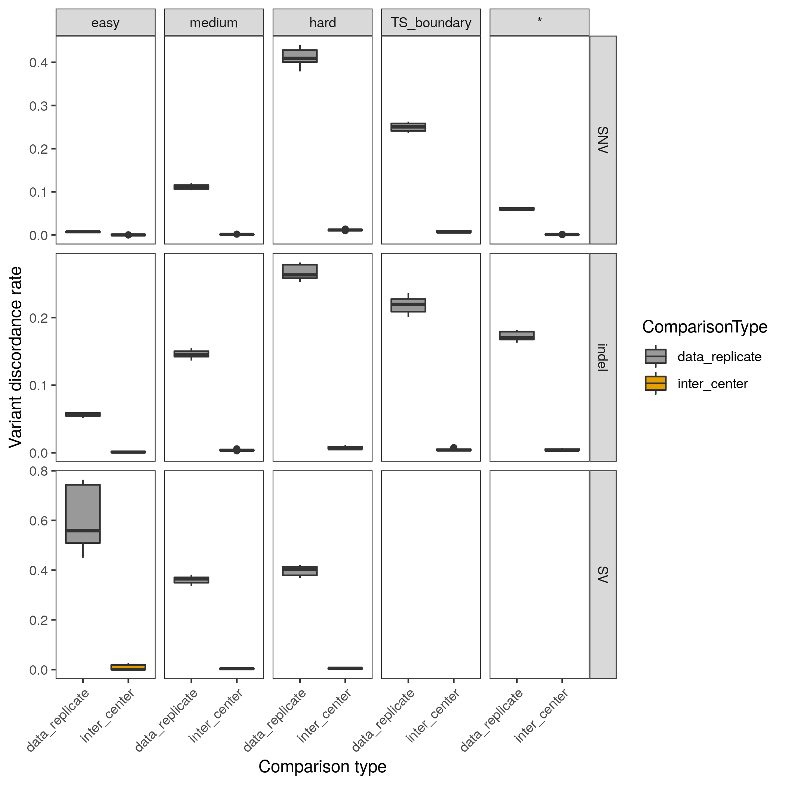

# Pipeline validation

These workflows provide a reproducible way to compare pipeline results (in CRAM format) to each other.  Variants are called from the CRAM files in a standardized way, and the resulting variant sets are compared to each other to determine how much any pipeline differences affect variant calling (i.e. the degree of functional equivalence).

## call_variants.wdl

[`call_variants.wdl`](call_variants.wdl) calls variants using GATK and Lumpy.  In addition to a few standard reference files (see [`call_variants_inputs.json`](call_variants_inputs.json), the workflow takes as input a list of sample names and associated CRAM/index locations.  Example input: [inputs/call_variants_id_list.txt](inputs/call_variants_id_list.txt).

## compare_variants.wdl

The inputs for [`compare_variants.wdl`](compare_variants.wdl) are specified in [inputs/compare_variants_inputs.json](inputs/compare_variants_inputs.json).  It takes a map of outputs from each variant calling step (produced in the `GatherGATK` and `GatherSVs` steps from the variant calling workflow) as well as a file specifying which samples to compare to each other, as well as a type for that comparison.  The sample names in this comparison file should match the names in the output maps from variant calling.  Example input: [inputs/comparison_list.txt](inputs/comparison_list.txt).  
In this example, the comparison between `NA12878.bi.1.d.WashU` and `NA12878.hgsc.1.d.WashU` is a "data_replicate" comparison - the input data for the CRAMs were sequenced at two different centers, but both CRAMs were produced by the WashU alignment pipeline.  On the other hand, the comparison between `NA12878.bi.1.d.NYGC` and `NA12878.bi.1.d.WashU` is an "inter_center" comparison.  The same sequence data inputs were aligned by both the NYGC and WashU pipelines.

The comparisons are all done in parallel, then plotted together in a box plot, facetted by variant type (SNV, indel, SV) and genomic region (easy, medium, hard).  There is one box per comparison type.

Note that the workflows are not actually interpreting the sample name or comparison type in any way - it is up to the user to define these in the id list and comparison list inputs.  This allows the workflow to be configured to show an arbitrary number of comparison types that would each be plotted separately.
